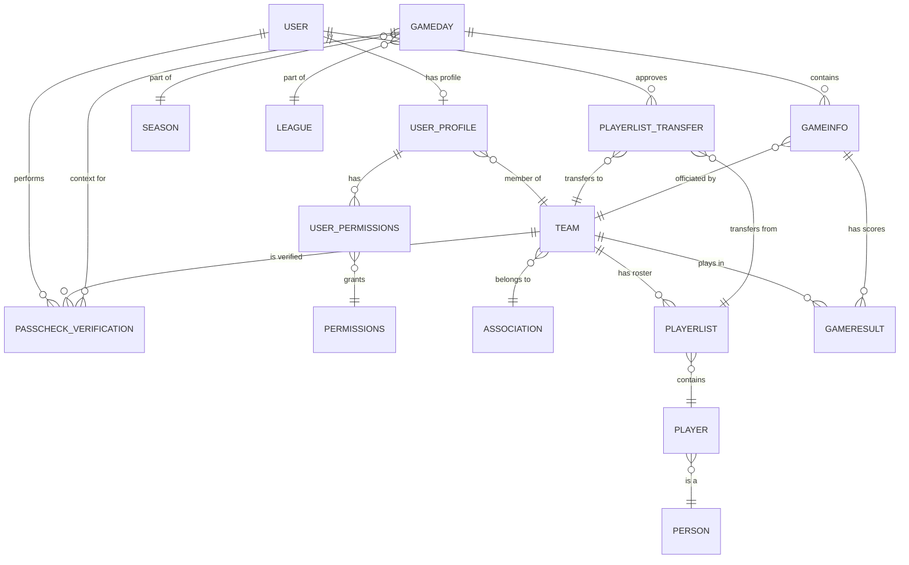

# LeagueSphere ER Model and SaaS Admin Analysis

The SaaS Admin view in `feature/admin-dashboard` aims to provide platform-wide metrics. However, the current implementation in `DashboardService` contains several inaccuracies regarding user roles and activity tracking.

## Entity-Relationship Model

The following model illustrates the core domains of LeagueSphere:
1.  **Identity**: Users and their Profiles.
2.  **Organization**: Associations, Leagues, and Teams.
3.  **Competition**: Gamedays, Game Metadata, and Results.
4.  **Compliance**: Players (pass-holders), Rosters, and Verifications.

## Data Inconsistency Analysis

The "wrong data" reported in the SaaS admin view likely stems from these issues in `dashboard/service/dashboard_service.py`:

### 1. Flawed Role Calculation
The current code calculates "Players" by simple subtraction:
`players_count = total_users - team_managers - officials`
- **Issue**: It doesn't account for **role overlap**. A user can be both a Team Manager and an Official. Subtracting both counts from the total will result in an undercount (or even negative number) of players.
- **Issue**: It defines "Players" as anyone who isn't a TM or Official, but many `User` accounts might just be spectators or inactive accounts, while actual competitive players (in the `Player` model) might not even have `User` accounts.

### 2. Narrow Activity Definition
"Active Today" only counts users who created a `PasscheckVerification` or `PlayerlistTransfer`.
- **Issue**: It ignores users who:
    - Logged in but didn't perform those specific actions.
    - Scored a game (`TeamLog`).
    - Created or updated a Gameday.

### 3. Role-to-User Disconnect
- **Passcheck Players**: Tracked in `passcheck.Player` via `Person` and `pass_number`.
- **User Accounts**: Tracked in `auth.User` and `gamedays.UserProfile`.
- The dashboard currently conflates these two different concepts.

## Recommendations

To fix the "wrong data", I propose:
1.  **Unique Role Counting**: Use sets of User IDs to correctly count unique users in each category (TM, Official, Player-User).
2.  **Broaden Activity**: Include `last_login` and `TeamLog` activity in the health metrics.
3.  **Separate Pass-holder Metrics**: Add a specific metric for `Player.objects.count()` to show the actual number of registered athletes (pass-holders), distinct from User accounts.
