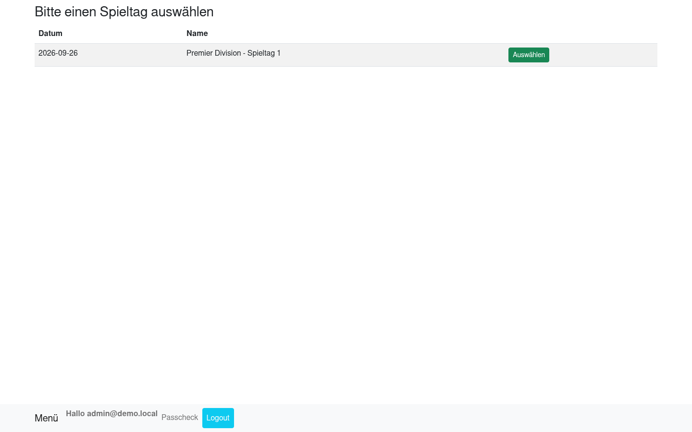
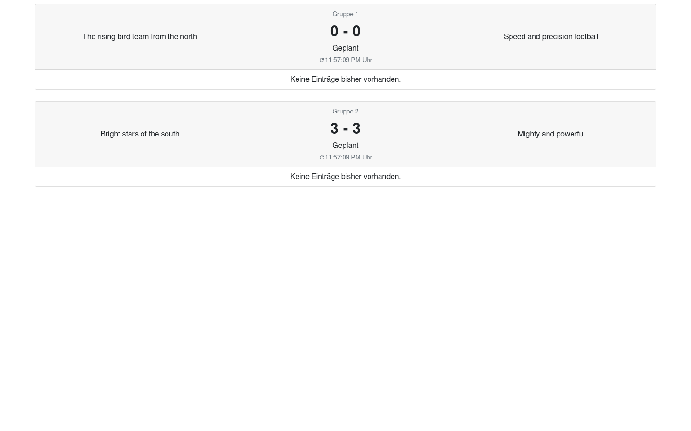
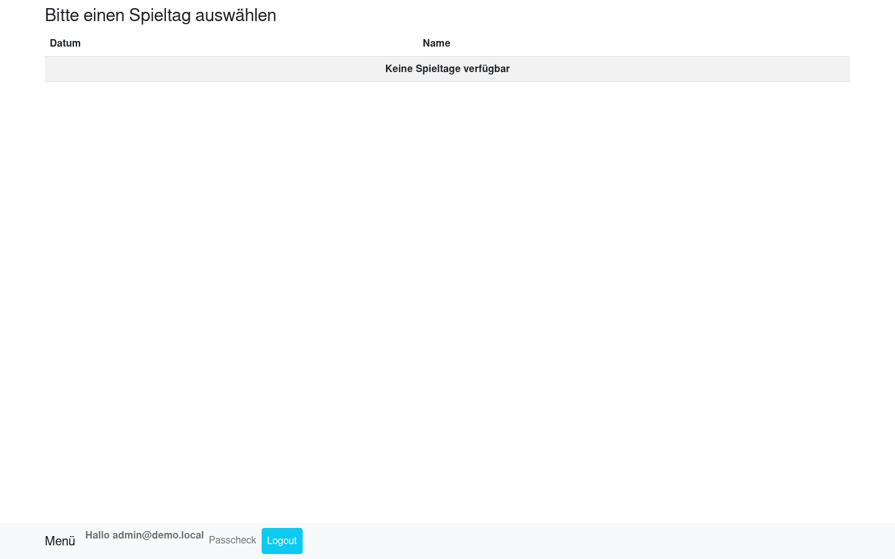
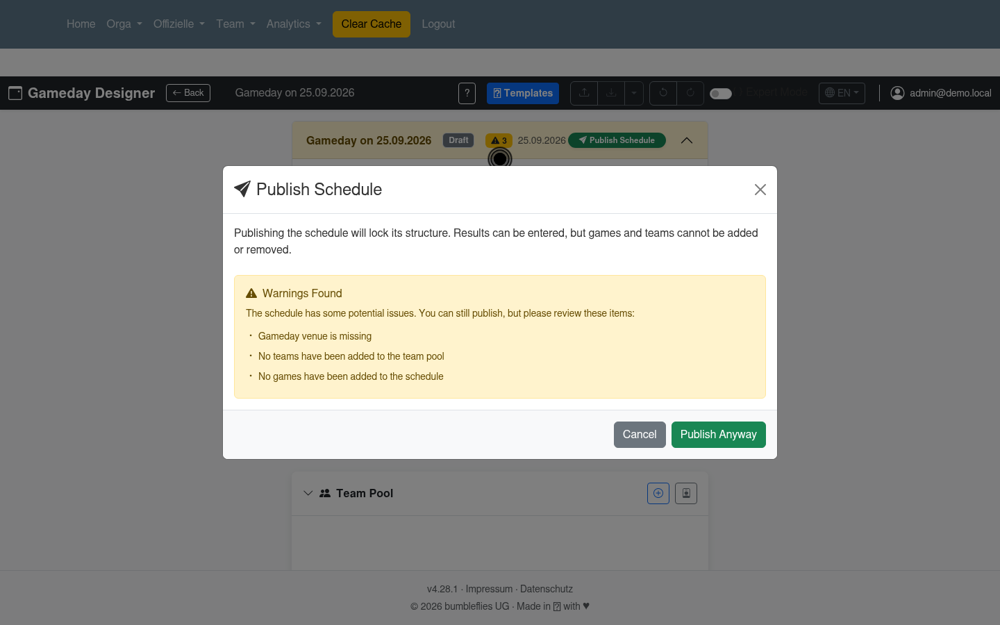
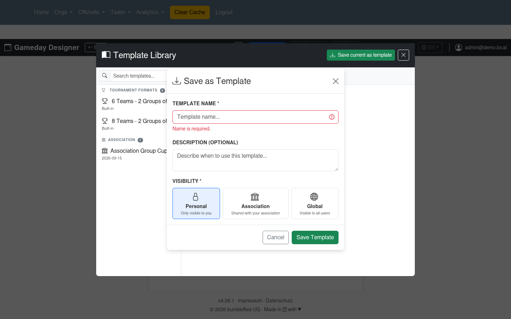

# Hardening Report: Gameday Designer → Scorecard → Liveticker (2026-09-25)

Headless-Chrome error-provocation against `https://demo.leaguesphere.app`
(demo reset nightly; findings reproduced 2026-09-25 ~23:40–00:05 UTC, app v4.28.1).
Priority order per request: designer first, then scorecard, then liveticker.

Companion: [domain knowledge + reusable harness](./hardening-domain-knowledge.md).

## Method

- Playwright-core driving system Chromium headless (`--no-sandbox`), login as
  `admin@demo.local`. Storyboard-style runner: navigate/click/fill + screenshot
  per step, console-error and HTTP ≥400 collectors per run.
- API provocations reuse the authenticated browser context (`Referer` + `Origin`
  + `X-CSRFToken` headers — without `Referer`, Django answers every mutating
  call with `403 CSRF Failed`, which is a harness artifact, not an app bug).
- Stage (`stage.leaguesphere.app`) was observe-only by agreement, but SSH
  (`cda@lehel.xyz`) rejects this host's key (`Permission denied (publickey)`),
  so realistic patterns were mined from demo seed data + repo services instead
  (see companion doc). No stage data was created, modified, or deleted.
- Demo mutations during runs were reverted (scratch gamedays 28/29/30 deleted
  via `204`; gameday 1+2 dates restored to seed values — verified). Seed
  scores are **random per nightly reset** (`seed_demo_data
  create_game_result`), so assert shapes, never values; `get_or_create`
  reseeding does not clean `TeamLog` rows.

## Environment caveats (not app bugs)

- `scorecard`'s `/api/gameday/list` filters `date=datetime.today()` and
  liveticker filters `date=datetime.today().date()` on **server local time**
  (`gamedays/api/views.py:350`, `liveticker/service/liveticker_service.py:25`).
  Shifting a gameday to *UTC* today around midnight does not surface it when
  the server is already on the next day (CEST). All "empty feed" observations
  below were taken with seed dates (Aug) — i.e. outside any live window.
- The two `404` console errors on `/scorecard/` are just the missing
  `favicon.ico` (see F5).

## Corrections (2026-09-26 review)

- **F7 withdrawn — not a bug.** The publish dialog explicitly warns about the
  empty schedule and requires "Publish Anyway". Warning + explicit confirm is
  the intended UX. (Issue #1984 closed.)
- **F6 corrected — setup was wrong, not the app.** Scorecard/liveticker
  correctly showed empty states: both filter by **server-local** today
  (CEST; the runner used UTC, a day behind). Re-run with the gameday dated to
  server-today (`PUT /api/gamedays/1/ {date: <server-today>}`):
  `/api/gameday/list` returns it, the scorecard lists it with `Auswählen`
  (screenshot below), and the liveticker renders the games. The remaining
  polish notes (hash-route `#/select-game` renders only the menu without the
  menu click-through; missing favicon) stand as minor.
- **F8 added** — liveticker shows team *descriptions* instead of names (found
  in the corrected populated-state pass).

### F8 [medium] Liveticker renders team descriptions where names belong

**Repro:**
1. Date a PUBLISHED gameday to server-local today (see above).
2. Open `/liveticker/` → game cards show e.g. "The rising bird team from the
   north" vs "Speed and precision football" instead of "Phoenix United" vs
   "Velocity FC".

**Root cause:** `liveticker/api/serializers.py:103-126` builds the frontend's
`home/away.name` from `FULL_NAME_HOME/AWAY` = `team__description`
(`liveticker/service/liveticker_service.py:74-81`); the real name
(`name_home/away` = `team__name`) is fetched but not used for `name`.
**Fix:** map `name` ← `team__name` (keep description as subtitle if wanted);
regression test asserting the feed contains team names.

## Findings (original run)

### F1 [high]

### F1 [high] `POST /api/gamelog/<id>` with malformed `event`/`half` → HTTP 500

**Repro** (authenticated as `admin@demo.local`, headers `Referer:
https://demo.leaguesphere.app/`, `Origin`, `X-CSRFToken` from `csrftoken`
cookie):
1. `POST /api/gamelog/1` body `{"gameId":1,"team":"Phoenix United","event":"NotARealEventXYZ","half":"FH"}` → `500`, custom `500 - Disqualifikation` page.
2. Same with `{"event":"Goal","half":"XX"}` → `500`.
3. Two parallel identical `POST /api/gamelog/1` `{"event":"Goal","half":"FH"}` → `500` + `500`.

**Expected:** `400` with a machine-readable error (unknown event / invalid half).
**Root cause:** `GameLogCreator.create()` (`gamedays/service/gamelog.py:23-25`)
does `for entry in self.event:` — a non-list `event` iterates characters and
dies on `entry.get` (`AttributeError`); `GameLogAPIView.post`
(`gamedays/api/game_views.py:87-106`) only catches `Gameinfo.DoesNotExist` /
`Team.DoesNotExist`. Verified: game 1 scores unchanged afterwards (fail-closed,
no corruption — the contract is still wrong).
**Fix:** validate `event` shape + `half` against allowed values in the view (or
serializer) and return `400`; add regression tests posting string-event and
bad-half. Re-confirmed stable across two runs (round2 S2b/S3b, corrected run:
3/3 still 500).

### F2 [high] `PUT /api/game/<id>/halftime|finalize|possession` on missing game → HTTP 500

**Repro:**
1. `PUT /api/game/999999/finalize` `{"note":"x"}` → `500`.
2. `PUT /api/game/999999/halftime` `{}` → `500`.

**Expected:** `404` (`No game found…`, matching the GET gamelog behavior).
**Root cause:** `GameService.__init__` → `GameinfoWrapper.from_id`
(`gamedays/service/wrapper/gameinfo_wrapper.py:19-21`) raises
`Gameinfo.DoesNotExist`, uncaught in `GameHalftimeAPIView.put`,
`GameFinalizeUpdateView.update`, `GamePossessionAPIView.put`
(`gamedays/api/game_views.py:149-170, 210-214`).
**Fix:** catch → `404` (same `NotFound(detail=…)` pattern as `GameLogAPIView`);
regression tests for unknown ids on all three endpoints.

### F3 [medium, needs product call] Halftime/finalize allowed on DRAFT-gameday games

**Repro:**
1. `PUT /api/game/7/halftime` `{}` (game 7 belongs to DRAFT gameday 4) → `200`.
2. `PUT /api/game/7/finalize` `{"note":"HARD out-of-order","hasFinalScoreChanged":false}` → `200`; game 7 now `beendet` with that note.

**Question:** is the game-level transition intentionally independent of gameday
`DRAFT`/`PUBLISHED`? If yes, document it; if no, guard in
`GameService.update_halftime/update_game_finished` (or the views) with `409`/`400`.
Either way the scorecard UI should reflect the rule.

**Status-matrix evidence (game 8, `Geplant`, round5.js P1):**
`finalize` direct → 200 `beendet` (no start needed) · `halftime` after finish
→ 200, status **regresses** to `"2. Halbzeit"` · `finalize` again → 200
`beendet` · `PUT setup` with valid body on `beendet` → 200, status stays
`beendet` (no restart; the earlier 400 was empty-body serializer validation).
Transitions overwrite freely in both directions — no guard anywhere.

### F4 [low] `PUT /api/game/<id>/possession` persists arbitrary strings

**Repro:** `PUT /api/game/1/possession` `{"team":"Not A Real Team XYZ"}` →
`200` (verified in run S5). `GameinfoWrapper.update_team_in_possession`
(`gameinfo_wrapper.py:48-52`) saves any string.
**Fix:** validate against the game's home/away teams (or team table) → `400`
otherwise; regression test.

### F5 [low] Missing `favicon.ico` → 404 console noise on every page

**Repro:** open `/scorecard/` (any SPA page); console shows 2× `Failed to load
resource: …/favicon.ico … 404`. **Fix:** ship a favicon in static assets —
cheap, and it stops masking real console errors during debugging.

### F6 [SUPERSEDED — see Corrections] Scorecard empty state

The original complaint (empty list "explains nothing") was based on a wrong
setup: with no gameday on server-local today the empty state is correct
behavior. Remaining minor polish: direct navigation to
`/scorecard/#/select-game` renders only the menu (selector requires the menu
click-through).

**Repro:**
1. Log in as `admin@demo.local`, open `/scorecard/`, click `Scorecard`.
2. With no gameday on server-today: table shows only `Keine Spieltage verfügbar`.

(Correct-state screenshot from the corrected run is under Corrections above.)

### F7 [WITHDRAWN — not a bug, see Corrections]

Original text kept for the record: publish dialog warns (no venue/teams/games)
and requires explicit "Publish Anyway" — intended UX.

**Repro:**
1. Designer dashboard (`/gamedays/gameday/design/`) → `Create Gameday`.
2. Immediately click `Publish Schedule` → warnings dialog lists missing venue,
   no teams, no games → click `Publish Anyway`.

The warning dialog itself is good UX; the question is whether an empty publish
should be possible at all (it locks the structure; downstream scorecard/
liveticker must then handle team-less/game-less gamedays). Confirm intended or
block empty publish server-side (`template_application_service` /
publish path).

## Verified controls (no bug found)

- Permission model on log delete works: referee deleting admin's entry →
  `403 {"detail":"You do not have permission…"}`, admin deleting own → 200
  (round6.js Q2, game 8).
- Valid scoring path works end-to-end at API level: TD+PAT list payload →
  `201` with recomputed halves (round5.js P2).

- Empty/whitespace template name rejected client-side (`Name is required.`,
  screenshot below) and server-side (`400`, incl. `darf nicht leer sein`);
  `num_teams=0`/malformed/empty template POSTs → `400` with field errors.

- `GET/DELETE /api/designer/templates/999999/` → `404` (no 500, no phantom 2xx).
- Games ETag works: conditional `GET /api/gamedays/1/games/` → `304`.
- `GET /api/gameday…` gamelog for unknown game → `404` on both `?other=1` and
  plain paths; bad `gamedayId` on games feed → `404 {"error":"Gameday not found"}`.
- Scratch gameday/template `DELETE` → `204`.

## Follow-ups (updated)

- ~~Re-run S1d/L1c inside the server-local window~~ — done 2026-09-26, see
  Corrections (populated scorecard list + liveticker feed verified; produced F8).
- VR-001 official-is-player UI validation still needs a canvas-level pass with
  teams assigned (react-select workaround in record-tutorial skill).
- Suggested regression tests: `gamedays/api/tests/` — gamelog 400 matrix,
  halftime/finalize/possession 404 matrix, possession-team validation,
  liveticker `name` ← `team__name` assertion.
